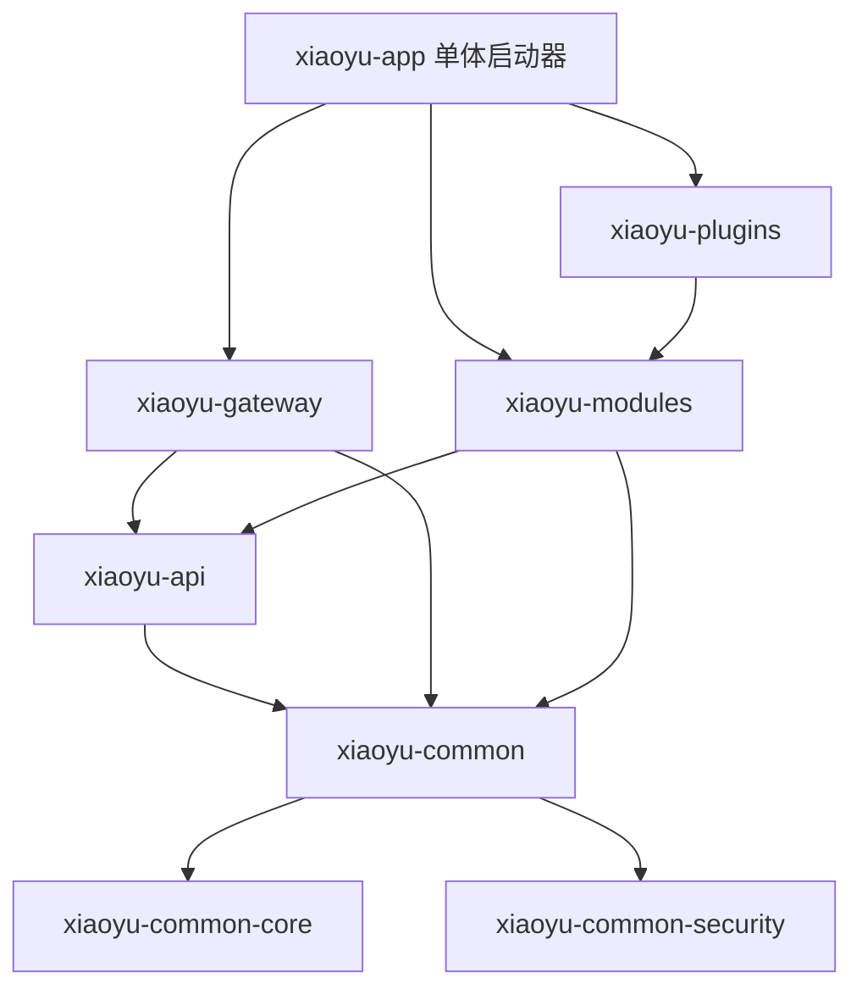
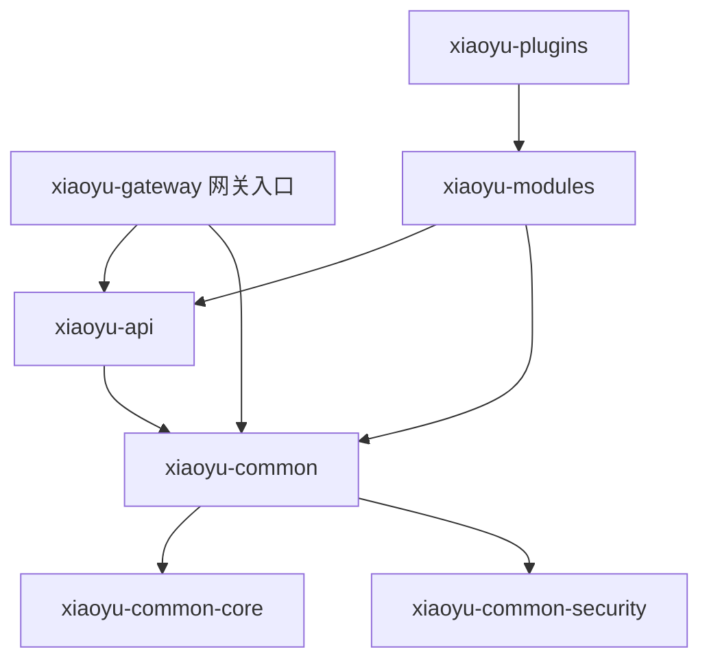
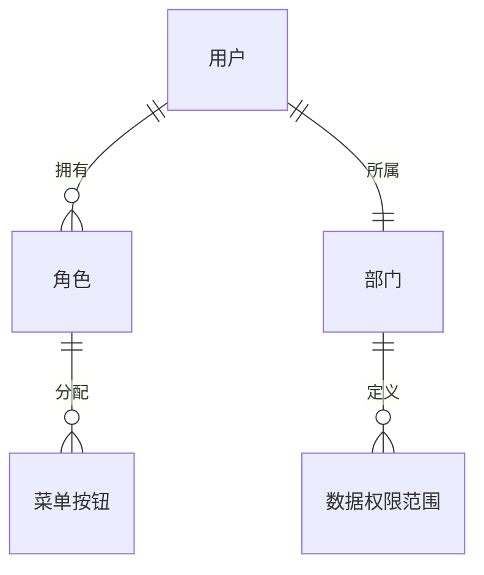
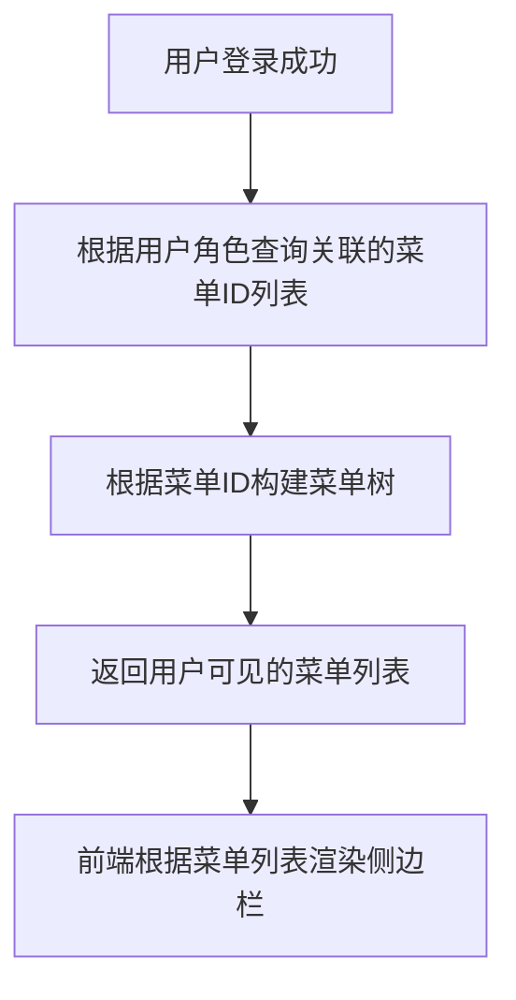
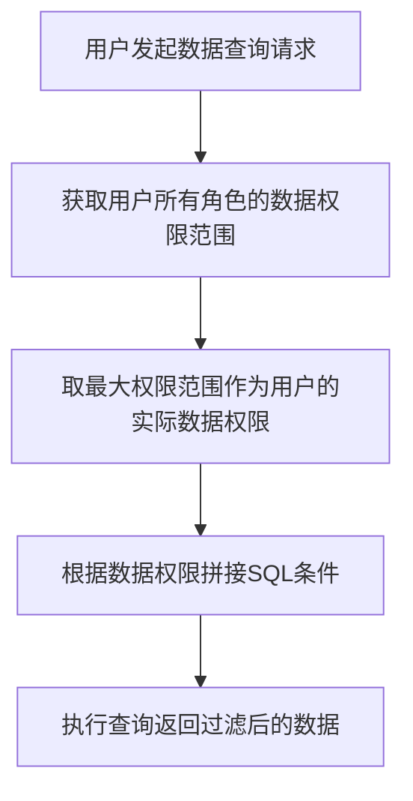

# 小羽快速开发框架 (XiaoyuCloudAdmin)

<p align="center">
  <b>基于 Spring Boot 3.x + React 的企业级快速开发框架</b>
</p>

<p align="center">
  集成 AI 智能助手 | 工作流引擎 | 即时通讯 | 多租户
</p>

---

## 1. 项目简介

小羽快速开发框架是一个现代化的企业级开发平台，采用前后端分离架构，提供完整的开发工具链和丰富的业务模块。

### 设计理念

| 原则  | 说明                     |
|:---:|:---------------------- |
| 易扩展 | 插件化架构设计，模块可插拔，支持按需引入   |
| 易二开 | 清晰的代码结构，完善的文档，降低二次开发门槛 |
| 规范化 | 统一的编码规范和设计模式，确保代码质量    |

---

## 2. 核心特性

| 特性    | 描述                                       |
|:-----:|:---------------------------------------- |
| 模块化架构 | 清晰的模块划分，支持按需引入，实现组件可插拔                   |
| 安全认证  | 基于 Sa-Token + JWT 的完善认证授权体系              |
| 多租户支持 | 灵活的多租户数据隔离策略，支持独立数据库/共享数据库模式             |
| AI 集成 | 集成 Spring AI + OpenAI + 阿里云通义千问等多种 AI 模型 |
| 工作流引擎 | 集成 Flowable 工作流引擎，支持 BPMN 2.0 标准         |
| 即时通讯  | 基于 WebSocket 的实时消息推送和群组聊天                |
| 监控运维  | 集成 Prometheus + Grafana，完善的系统监控和运维工具     |
| 代码生成  | 基于模板的快速代码生成，一键生成前后端代码                    |
| 定时任务  | 集成 XXL-Job 分布式任务调度平台                     |
| 响应式设计 | 支持多端适配的现代化 UI，完美兼容 PC/平板/移动端             |
| 文件存储  | 支持本地、OSS、COS、MinIO等多种存储方式，自动切换和负载均衡      |

---

## 3. 技术架构

### 3.1 后端技术栈

| 类别    | 技术                   | 说明              |
|:-----:|:--------------------:|:--------------- |
| 核心框架  | Java 21              | 开发语言            |
|       | Spring Boot 3.5.x    | 核心框架            |
|       | Spring Cloud 2024.x  | 微服务框架           |
|       | Spring Cloud Alibaba |                  |
|       | OpenFeign           | 服务调用+容错降级    |
| 数据层   | MySQL 8.0+           | 关系型数据库          |
|       | MongoDB              | 文档数据库（聊天记录、日志）  |
|       | Elasticsearch        | 搜索引擎（全文检索、日志分析） |
|       | MyBatis-Flex         | ORM 框架          |
|       | Redisson             | Redis 客户端，分布式锁  |
|       | Caffeine             | 本地缓存            |
| 安全认证  | Sa-Token             | 权限认证框架          |
|       | JWT                  | Token 方案        |
| AI 集成 | Spring AI            | AI 框架           |
| 微服务组件 | Nacos                | 服务注册与配置中心       |
|       | Sentinel             | 流量控制和熔断降级       |
|       | Seata                | 分布式事务解决方案       |
|       | Elasticsearch        | 搜索引擎、日志存储       |
|       | RocketMQ             | 消息队列            |
|       | Micrometer           | 应用指标收集          |
|       | Zipkin               | 分布式链路追踪         |
| 工具库   | Hutool               | Java 工具类库       |
|       | Lombok               | 代码生成注解          |
| 文件存储  | MinIO/OSS/COS        | 对象存储服务          |
| 工作流   | Flowable             | BPMN 2.0 工作流引擎  |

### 3.2 前端技术栈

| 技术             | 说明       |
|:--------------:|:-------- |
| Vue 3.x        | UI 框架    |
| TypeScript 5.x | 类型支持     |
| Vite 6.x       | 构建工具     |
| Element Plus   | UI 组件库   |
| Pinia          | 状态管理     |
| Vue Router     | 路由管理     |
| Axios          | HTTP 客户端 |

### 3.3 模块结构

#### 3.3.1 模块总览

| 模块                      | 说明                       | 类型  | 结构        |
|:-----------------------:|:------------------------ |:---:|:--------- |
| xiaoyu-api              | API模块聚合（各业务API接口定义）      | API | 聚合（多个子模块） |
| xiaoyu-api-user         | 用户服务API接口定义              | API | 独立        |
| xiaoyu-api-system       | 系统管理API接口定义              | API | 独立        |
| xiaoyu-api-auth         | 认证授权API接口定义              | API | 独立        |
| xiaoyu-api-ai           | AI服务API接口定义              | API | 独立        |
| xiaoyu-api-workflow     | 工作流API接口定义               | API | 独立        |
| xiaoyu-api-im           | 即时通讯API接口定义              | API | 独立        |
| xiaoyu-api-file         | 文件服务API接口定义              | API | 独立        |
| xiaoyu-api-report       | 报表服务API接口定义              | API | 独立        |
| xiaoyu-common           | 公共模块聚合（工具类、异常、安全、缓存）     | 基础  | 聚合（3个子模块） |
| xiaoyu-common-core      | 核心工具类、异常处理、结果封装          | 基础  | 独立        |
| xiaoyu-common-security  | Sa-Token安全认证、权限拦截        | 基础  | 独立        |
| xiaoyu-gateway          | API网关（路由、限流、鉴权）          | 网关  | 独立        |
| xiaoyu-modules          | 业务模块聚合（各业务服务实现）          | 业务  | 聚合（多个子模块） |
| xiaoyu-module-system    | 系统管理业务模块（用户、角色、部门、菜单、字典） | 业务  | 独立        |
| xiaoyu-module-auth      | 认证授权业务模块（登录、Token、验证码）   | 业务  | 独立        |
| xiaoyu-module-ai        | AI智能助手业务模块               | 业务  | 独立        |
| xiaoyu-module-workflow  | 工作流引擎业务模块                | 业务  | 独立        |
| xiaoyu-module-im        | 即时通讯业务模块                 | 业务  | 独立        |
| xiaoyu-module-file      | 文件存储业务模块                 | 业务  | 独立        |
| xiaoyu-module-report    | 报表服务业务模块                 | 业务  | 独立        |
| xiaoyu-module-monitor   | 系统监控业务模块                 | 业务  | 独立        |
| xiaoyu-module-generator | 代码生成业务模块                 | 业务  | 独立        |
| xiaoyu-module-job       | 定时任务业务模块                 | 业务  | 独立        |
| xiaoyu-plugins          | 插件模块聚合                   | 插件  | 聚合（多个子模块） |
| xiaoyu-plugin-xxx       | 示例插件模块                   | 插件  | 独立        |

#### 3.3.2 Maven 项目结构

```
backend/                          # 后端根目录
├── pom.xml                       # 父POM (xiaoyu-parent)，版本管理
│
├── xiaoyu-api/                   # API模块聚合
│   ├── xiaoyu-api-user/          # 用户服务API接口定义
│   │   ├── src/main/java/
│   │   │   ├── api/              # Feign 接口
│   │   │   ├── dto/              # 数据传输对象
│   │   │   └── vo/               # 视图对象
│   │   └── pom.xml
│   ├── xiaoyu-api-system/        # 系统管理API接口定义
│   │   ├── src/main/java/
│   │   │   ├── api/
│   │   │   ├── dto/
│   │   │   └── vo/
│   │   └── pom.xml
│   ├── xiaoyu-api-auth/          # 认证授权API接口定义
│   ├── xiaoyu-api-ai/            # AI服务API接口定义
│   ├── xiaoyu-api-workflow/      # 工作流API接口定义
│   ├── xiaoyu-api-im/            # 即时通讯API接口定义
│   ├── xiaoyu-api-file/          # 文件服务API接口定义
│   ├── xiaoyu-api-report/        # 报表服务API接口定义
│   └── pom.xml
│
├── xiaoyu-common/                # 公共模块聚合
│   ├── xiaoyu-common-core/       # 核心工具类
│   │   ├── src/main/java/
│   │   │   ├── annotation/       # 自定义注解
│   │   │   ├── constant/         # 常量定义
│   │   │   ├── enums/            # 枚举类
│   │   │   ├── exception/        # 异常处理
│   │   │   ├── result/           # 统一响应
│   │   │   └── util/             # 工具类
│   │   └── pom.xml
│   ├── xiaoyu-common-security/   # 安全认证模块
│   │   ├── src/main/java/
│   │   │   ├── config/           # Sa-Token配置
│   │   │   ├── filter/           # 过滤器
│   │   │   └── handler/          # 权限处理器
│   │   └── pom.xml
│   └── pom.xml
│
├── xiaoyu-gateway/               # API网关
│   ├── src/main/java/
│   │   ├── config/               # 网关配置
│   │   ├── filter/               # 过滤器
│   │   └── handler/              # 处理器
│   └── pom.xml
│
├── xiaoyu-modules/               # 业务模块聚合
│   ├── xiaoyu-module-system/     # 系统管理业务模块
│   │   ├── src/main/java/
│   │   │   ├── controller/       # 控制器
│   │   │   ├── service/          # 服务层
│   │   │   │   └── impl/         # 服务实现
│   │   │   ├── mapper/           # 数据访问层
│   │   │   └── entity/           # 实体类
│   │   └── pom.xml
│   ├── xiaoyu-module-auth/       # 认证授权业务模块
│   │   ├── src/main/java/
│   │   │   ├── controller/
│   │   │   ├── service/
│   │   │   │   └── impl/
│   │   │   ├── mapper/
│   │   │   └── entity/
│   │   └── pom.xml
│   ├── xiaoyu-module-ai/         # AI服务业务模块
│   ├── xiaoyu-module-workflow/   # 工作流业务模块
│   ├── xiaoyu-module-im/         # 即时通讯业务模块
│   ├── xiaoyu-module-file/       # 文件存储业务模块
│   ├── xiaoyu-module-report/     # 报表服务业务模块
│   ├── xiaoyu-module-monitor/    # 系统监控业务模块
│   ├── xiaoyu-module-generator/  # 代码生成业务模块
│   ├── xiaoyu-module-job/        # 定时任务业务模块
│   └── pom.xml
│
├── xiaoyu-plugins/               # 插件模块聚合
│   ├── xiaoyu-plugin-xxx/        # 示例插件模块
│   │   ├── src/main/java/
│   │   │   ├── config/           # 插件配置
│   │   │   ├── service/          # 插件服务
│   │   │   └── spi/              # SPI接口实现
│   │   └── pom.xml
│   └── pom.xml
│
└── xiaoyu-app/                   # 单体应用启动器（仅单体模式）
    ├── src/main/java/
    │   └── XiaoyuApplication.java
    ├── src/main/resources/
    │   ├── application.yml
    │   └── application-dev.yml
    └── pom.xml
```

#### 3.3.3 OpenFeign 保底机制

为确保微服务调用的高可用性，每个 Feign 接口必须实现降级（Fallback）方案。

**保底策略：**

| 策略 | 说明 | 适用场景 |
|:---:|:---|:---|
| Fallback | 同步降级，返回默认值或空集合 | 读操作、列表查询 |
| FallbackFactory | 统一降级处理，记录异常日志 | 统一异常处理、监控告警 |
| Sentinel 熔断 | 结合 Sentinel 实现熔断降级 | 高并发、流量控制 |

**目录结构：**

```
xiaoyu-api-xxx/
├── src/main/java/
│   ├── api/                    # Feign 接口定义
│   │   └── XxxApi.java
│   ├── fallback/               # Feign 降级实现（保底机制）
│   │   ├── XxxApiFallback.java       # Fallback 实现
│   │   └── XxxApiFallbackFactory.java # 统一降级工厂
│   ├── dto/
│   └── vo/
└── pom.xml
```

**实现示例：**

```java
// 1. Feign 接口定义
@FeignClient(name = "xiaoyu-system", path = "/system/user", fallback = UserApiFallback.class)
public interface UserApi {
    @GetMapping("/list")
    List<UserVO> getUserList();
}

// 2. Fallback 实现（保底机制）
@Component
public class UserApiFallback implements UserApi {
    @Override
    public List<UserVO> getUserList() {
        // 返回空集合，避免调用方空指针
        return Collections.emptyList();
    }
}

// 3. FallbackFactory 统一降级（推荐）
@Component
public class UserApiFallbackFactory implements FallbackFactory<UserApi> {
    @Override
    public UserApi create(Throwable cause) {
        // 记录降级日志
        log.warn("UserApi 调用降级: {}", cause.getMessage());
        return new UserApi() {
            @Override
            public List<UserVO> getUserList() {
                return Collections.emptyList();
            }
        };
    }
}
```

**降级规则：**

| 场景 | 降级策略 | 返回值 |
|:---|:---|:---|
| 服务不可用 | Fallback | 空集合/空对象/默认值 |
| 超时 | Fallback | 超时提示/null |
| 熔断打开 | Fallback | 熔断提示/null |
| 网络异常 | FallbackFactory | 统一降级响应 |

**注意事项：**

- 单体模式下不使用 Feign，直接注入实现类
- 降级方法必须与原方法签名一致
- 建议使用 FallbackFactory 统一处理降级逻辑，便于日志记录和监控
#### 3.3.3 模块依赖关系

**单体模式依赖关系：**



**微服务模式依赖关系：**



**依赖规则：**

| 规则    | 说明                                               |
|:-----:|:------------------------------------------------ |
| 单向依赖  | 下层模块不可依赖上层模块                                     |
| 横向隔离  | 同层模块之间不可相互依赖                                     |
| API隔离 | 业务模块通过API模块暴露接口（微服务模式）                           |
| 公共下沉  | 公共逻辑下沉到xiaoyu-common模块                           |
| 网关唯一  | 仅xiaoyu-gateway依赖所有xiaoyu-api模块                  |
| 模块聚合  | xiaoyu-api/xiaoyu-modules/xiaoyu-plugins聚合同类型子模块 |

#### 3.3.4 模块职责说明

**基础模块**

| 模块                     | 职责       | 核心内容                          |
|:----------------------:|:-------- |:----------------------------- |
| xiaoyu-common-core     | 工具类和通用定义 | 异常类、常量、枚举、注解、工具方法             |
| xiaoyu-common-security | 安全认证     | Sa-Token配置、权限拦截、Token处理、JWT支持 |

**API模块**

| 模块                  | 职责        | 核心内容                |
|:-------------------:|:--------- |:------------------- |
| xiaoyu-api-user     | 用户服务API定义 | 用户管理相关的API接口定义      |
| xiaoyu-api-system   | 系统管理API定义 | 系统管理相关的API接口定义      |
| xiaoyu-api-auth     | 认证授权API定义 | 登录、认证相关的API接口定义     |
| xiaoyu-api-ai       | AI服务API定义 | AI对话、知识库相关的API接口定义  |
| xiaoyu-api-workflow | 工作流API定义  | 流程设计、任务处理相关的API接口定义 |
| xiaoyu-api-im       | 即时通讯API定义 | 消息、群组相关的API接口定义     |
| xiaoyu-api-file     | 文件服务API定义 | 文件上传、下载相关的API接口定义   |
| xiaoyu-api-report   | 报表服务API定义 | 报表设计、导出相关的API接口定义   |

**业务模块**

| 模块                      | 职责       | 核心内容                      |
|:-----------------------:|:-------- |:------------------------- |
| xiaoyu-module-system    | 系统管理业务实现 | 用户、角色、部门、菜单、字典的业务逻辑和数据访问  |
| xiaoyu-module-auth      | 认证授权业务实现 | 登录、Token、验证码的业务逻辑实现       |
| xiaoyu-module-ai        | AI服务业务实现 | 对话、知识库、模型管理的业务逻辑实现        |
| xiaoyu-module-workflow  | 工作流业务实现  | Flowable流程引擎集成、任务处理业务逻辑   |
| xiaoyu-module-im        | 即时通讯业务实现 | WebSocket消息推送、群组管理业务逻辑    |
| xiaoyu-module-file      | 文件存储业务实现 | 多存储引擎实现（本地/OSS/COS/MinIO） |
| xiaoyu-module-report    | 报表服务业务实现 | 报表设计、数据导出、图表组件业务逻辑        |
| xiaoyu-module-monitor   | 系统监控业务实现 | 监控指标收集、健康检查、日志管理          |
| xiaoyu-module-generator | 代码生成业务实现 | 模板引擎、表结构读取、代码生成业务逻辑       |
| xiaoyu-module-job       | 定时任务业务实现 | XXL-Job集成、任务调度业务逻辑        |

**插件模块**

| 模块                | 职责   | 核心内容              |
|:-----------------:|:---- |:----------------- |
| xiaoyu-plugin-xxx | 插件扩展 | SPI接口实现、插件配置、扩展功能 |

**特殊模块**

| 模块             | 说明                           |
|:--------------:|:---------------------------- |
| xiaoyu-gateway | API网关，路由转发、限流熔断、统一鉴权（仅微服务模式） |
| xiaoyu-app     | 单体应用启动器，聚合所有服务模块（仅单体模式）      |

#### 3.3.5 运行模式

**单体模式**

```yaml
# application.yml
xiaoyu:
  mode: monolith  # 或 standalone
```

- 所有服务打包成一个应用（通过 xiaoyu-app 启动）
- 内部模块间通过 Spring 本地调用（无需Feign）
- 适合小型项目、开发环境、快速启动
- 构建命令：`mvn clean package -Pmonolith`

**微服务模式**

```yaml
# application.yml
xiaoyu:
  mode: microservice
```

- 各业务模块独立部署为单独的应用
- 通过 xiaoyu-gateway 统一入口访问
- 服务间通过 OpenFeign + Nacos 进行远程调用
- 适合大型项目、生产环境、高可用集群
- 构建命令：`mvn clean package -Pmicroservice`

**架构切换**

通过 Maven Profile 和配置文件配合实现架构切换：

1. Maven Profile 控制模块打包组合
2. 配置文件（`application.yml` 中的 `xiaoyu.mode`）控制运行模式
3. 微服务模式下，各服务需配置 Nacos 服务注册和发现

#### 3.3.6 模块端口分配

| 服务                      | 端口   | 说明     | 结构  |
|:-----------------------:|:----:|:------ |:--- |
| xiaoyu-gateway          | 8080 | API网关  | 独立  |
| xiaoyu-module-auth      | 8081 | 认证服务   | 独立  |
| xiaoyu-module-system    | 8082 | 系统服务   | 独立  |
| xiaoyu-module-ai        | 8083 | AI服务   | 独立  |
| xiaoyu-module-im        | 8084 | 即时通讯   | 独立  |
| xiaoyu-module-workflow  | 8085 | 工作流服务  | 独立  |
| xiaoyu-module-monitor   | 8086 | 监控服务   | 独立  |
| xiaoyu-module-file      | 8087 | 文件存储服务 | 独立  |
| xiaoyu-module-generator | 8088 | 代码生成   | 独立  |
| xiaoyu-module-job       | 8089 | 定时任务   | 独立  |
| xiaoyu-module-report    | 8090 | 报表服务   | 独立  |

**说明：**

- 单体模式下所有服务运行在同一个端口（默认8080）
- 微服务模式下各服务独立端口，通过网关统一访问
- 端口可根据实际需求调整，需同步修改配置和防火墙规则

---

## 4. 功能模块

### 4.1 系统管理

| 功能    | 说明                    |
|:-----:|:--------------------- |
| 用户管理  | 用户增删改查、密码重置、状态管理、组织架构 |
| 角色管理  | 角色权限分配、数据权限控制         |
| 部门管理  | 组织架构管理、层级关系维护         |
| 菜单管理  | 动态菜单配置、权限按钮控制         |
| 字典管理  | 系统字典维护、多类型支持          |
| 参数配置  | 系统参数设置、动态配置           |
| 多租户管理 | 租户创建、数据隔离、独立配置        |
| 登录认证  | 数字验证码、邮箱验证码、多种登录方式    |

#### 4.1.1 用户管理

**功能需求**

| 功能点  | 描述                                     |
|:----:|:-------------------------------------- |
| 用户列表 | 分页展示用户列表，支持按用户名/昵称/手机号/邮箱/状态/部门筛选，支持排序 |
| 新增用户 | 创建新用户账号，设置基本信息、所属部门、分配角色               |
| 编辑用户 | 修改用户基本信息、部门归属、角色分配                     |
| 删除用户 | 逻辑删除用户，被删除用户无法登录系统                     |
| 用户详情 | 查看用户完整信息，包括基本信息、角色列表、操作日志              |
| 密码重置 | 管理员重置用户密码，支持生成随机密码或指定密码                |
| 状态管理 | 启用/禁用用户账号，禁用后用户无法登录                    |
| 批量操作 | 支持批量删除、批量启用/禁用、批量重置密码                  |
| 导入导出 | 支持用户数据Excel导入导出                        |

**业务规则**

| 规则编号   | 规则描述                           |
|:------:|:------------------------------ |
| UR-001 | 用户名全局唯一，长度2-50字符，仅支持字母、数字、下划线  |
| UR-002 | 密码长度6-100字符，必须包含字母和数字，建议包含特殊字符 |
| UR-003 | 手机号格式校验，同一租户内手机号唯一             |
| UR-004 | 邮箱格式校验，同一租户内邮箱唯一               |
| UR-005 | 用户至少关联一个部门，可关联多个角色             |
| UR-006 | 用户名不可修改，其他信息可修改                |
| UR-007 | 禁用用户时，自动踢出在线会话                 |
| UR-008 | 删除用户前需检查是否有关联业务数据              |
| UR-009 | 超级管理员账号不可删除、不可禁用               |
| UR-010 | 用户创建时默认状态为正常，默认密码可配置           |

**验收标准**

| 场景         | 预期结果                  |
|:----------:|:--------------------- |
| 创建用户-正常    | 填写完整信息后提交，创建成功，返回用户ID |
| 创建用户-用户名重复 | 提示"用户名已存在"，创建失败       |
| 创建用户-必填项为空 | 提示对应字段"不能为空"          |
| 编辑用户       | 修改信息后保存成功，历史数据更新      |
| 删除用户       | 用户状态变为已删除，不在列表显示，无法登录 |
| 密码重置       | 重置成功后原密码失效，新密码生效      |
| 启用/禁用用户    | 状态切换成功，禁用用户被踢出在线状态    |

#### 4.1.2 角色管理

**功能需求**

| 功能点  | 描述                                 |
|:----:|:---------------------------------- |
| 角色列表 | 展示所有角色，支持按角色名称/编码/状态筛选             |
| 新增角色 | 创建新角色，设置角色名称、编码、排序、数据权限范围          |
| 编辑角色 | 修改角色基本信息、菜单权限、数据权限                 |
| 删除角色 | 删除角色，解除与用户的关联关系                    |
| 权限分配 | 为角色分配菜单权限和按钮权限                     |
| 数据权限 | 设置角色的数据权限范围（全部/自定义/本部门/本部门及以下/仅本人） |

**业务规则**

| 规则编号   | 规则描述                           |
|:------:|:------------------------------ |
| RL-001 | 角色编码全局唯一，长度2-50字符，仅支持字母、数字、下划线 |
| RL-002 | 角色名称租户内唯一                      |
| RL-003 | 角色必须关联至少一个菜单权限                 |
| RL-004 | 删除角色前需检查是否有用户关联，有则提示不可删除       |
| RL-005 | 超级管理员角色不可删除、不可修改编码             |
| RL-006 | 数据权限继承规则：用户取所拥有角色的最大权限范围       |

**验收标准**

| 场景        | 预期结果                |
|:---------:|:------------------- |
| 创建角色-正常   | 填写完整信息后提交，创建成功      |
| 创建角色-编码重复 | 提示"角色编码已存在"，创建失败    |
| 分配权限      | 菜单树勾选后保存成功，角色拥有对应权限 |
| 删除角色-无关联  | 删除成功，角色列表移除         |
| 删除角色-有关联  | 提示"该角色已分配给用户，不可删除"  |

#### 4.1.3 部门管理

**功能需求**

| 功能点  | 描述                       |
|:----:|:------------------------ |
| 部门树  | 以树形结构展示组织架构，支持展开/折叠      |
| 新增部门 | 创建新部门，设置部门名称、编码、负责人、上级部门 |
| 编辑部门 | 修改部门基本信息、负责人、上级部门        |
| 删除部门 | 删除部门，同时处理下级部门和关联用户       |
| 部门排序 | 支持拖拽或输入排序号调整部门顺序         |

**业务规则**

| 规则编号   | 规则描述                   |
|:------:|:---------------------- |
| DP-001 | 部门编码租户内唯一              |
| DP-002 | 部门名称同一上级下唯一            |
| DP-003 | 部门层级最多支持10级            |
| DP-004 | 删除部门前需检查是否有下级部门，有则不可删除 |
| DP-005 | 删除部门前需检查是否有关联用户，有则不可删除 |
| DP-006 | 部门负责人自动拥有该部门数据权限       |

**验收标准**

| 场景       | 预期结果              |
|:--------:|:----------------- |
| 创建部门     | 创建成功，部门树中显示新部门    |
| 创建子部门    | 创建成功，作为父部门的子节点显示  |
| 编辑部门     | 修改后保存成功，部门信息更新    |
| 删除部门-有下级 | 提示"存在下级部门，不可删除"   |
| 删除部门-有用户 | 提示"存在关联用户，不可删除"   |
| 部门排序     | 拖拽后顺序调整成功，排序号自动更新 |

#### 4.1.4 菜单管理

**功能需求**

| 功能点  | 描述                         |
|:----:|:-------------------------- |
| 菜单树  | 以树形结构展示菜单层级，支持展开/折叠        |
| 新增目录 | 创建菜单目录（容器节点），设置名称、图标、排序    |
| 新增菜单 | 创建菜单项，设置名称、路由、组件路径、图标、权限标识 |
| 新增按钮 | 创建按钮权限，设置名称、权限标识           |
| 编辑菜单 | 修改菜单信息、图标、排序、可见性           |
| 删除菜单 | 删除菜单，同时处理下级菜单              |

**业务规则**

| 规则编号   | 规则描述                                    |
|:------:|:--------------------------------------- |
| MN-001 | 菜单名称同一上级下唯一                             |
| MN-002 | 路由地址同一上级下唯一                             |
| MN-003 | 权限标识全局唯一，格式：模块:资源:操作（如 system:user:add） |
| MN-004 | 外链菜单的组件路径为空                             |
| MN-005 | 按钮类型必须关联父菜单                             |
| MN-006 | 删除菜单前需检查是否有下级菜单                         |
| MN-007 | 删除菜单时同时删除角色与菜单的关联关系                     |

**验收标准**

| 场景       | 预期结果            |
|:--------:|:--------------- |
| 创建目录     | 创建成功，菜单树中显示目录节点 |
| 创建菜单     | 创建成功，可配置路由和权限   |
| 创建按钮     | 创建成功，关联父菜单      |
| 删除菜单-有子级 | 提示"存在子菜单，不可删除"  |
| 删除菜单-无子级 | 删除成功，角色权限同步更新   |

#### 4.1.5 字典管理

**功能需求**

| 功能点    | 描述                  |
|:------:|:------------------- |
| 字典类型列表 | 展示所有字典类型，支持按名称/编码筛选 |
| 新增字典类型 | 创建字典分类，设置名称、编码      |
| 编辑字典类型 | 修改字典类型名称、状态         |
| 删除字典类型 | 删除字典类型及其下所有字典数据     |
| 字典数据管理 | 管理字典类型下的具体数据项       |
| 新增字典数据 | 添加字典项，设置标签、值、排序     |
| 编辑字典数据 | 修改字典项标签、值、状态        |
| 删除字典数据 | 删除单个字典项             |

**业务规则**

| 规则编号   | 规则描述               |
|:------:|:------------------ |
| DC-001 | 字典编码全局唯一           |
| DC-002 | 同一字典类型下，字典值唯一      |
| DC-003 | 字典数据状态独立控制，不影响其他数据 |
| DC-004 | 系统内置字典不可删除（通过配置标识） |

**验收标准**

| 场景     | 预期结果             |
|:------:|:---------------- |
| 创建字典类型 | 创建成功，列表显示新类型     |
| 添加字典数据 | 添加成功，字典项显示在对应类型下 |
| 字典值重复  | 提示"字典值已存在"       |
| 禁用字典数据 | 禁用后该字典项不在下拉列表显示  |

#### 4.1.6 参数配置

**功能需求**

| 功能点  | 描述                  |
|:----:|:------------------- |
| 参数列表 | 展示所有系统参数，支持按名称/键名筛选 |
| 新增参数 | 添加系统参数，设置名称、键名、值    |
| 编辑参数 | 修改参数值、备注信息          |
| 删除参数 | 删除非内置参数             |
| 刷新缓存 | 重新加载参数到缓存           |

**业务规则**

| 规则编号   | 规则描述        |
|:------:|:----------- |
| CF-001 | 参数键名全局唯一    |
| CF-002 | 系统内置参数不可删除  |
| CF-003 | 参数修改后自动刷新缓存 |
| CF-004 | 敏感参数值加密存储   |

**验收标准**

| 场景     | 预期结果            |
|:------:|:--------------- |
| 创建参数   | 创建成功，可通过键名获取参数值 |
| 修改参数   | 修改后立即生效，缓存同步更新  |
| 删除内置参数 | 提示"系统内置参数不可删除"  |

#### 4.1.7 多租户管理

**功能需求**

| 功能点     | 描述                    |
|:-------:|:--------------------- |
| 租户列表    | 展示所有租户，支持按名称/状态筛选     |
| 新增租户    | 创建新租户，设置基本信息、套餐、有效期   |
| 编辑租户    | 修改租户信息、套餐、有效期         |
| 启用/禁用租户 | 控制租户状态，禁用后该租户所有用户无法登录 |
| 租户套餐    | 管理租户可用的功能模块和菜单        |
| 数据隔离    | 确保租户间数据完全隔离           |

**业务规则**

| 规则编号   | 规则描述                    |
|:------:|:----------------------- |
| TN-001 | 租户编码全局唯一                |
| TN-002 | 租户过期后自动禁用               |
| TN-003 | 租户数据物理隔离（通过tenant_id字段） |
| TN-004 | 主租户不可删除                 |
| TN-005 | 禁用租户时踢出该租户所有在线用户        |

**验收标准**

| 场景   | 预期结果            |
|:----:|:--------------- |
| 创建租户 | 创建成功，自动初始化租户数据  |
| 租户隔离 | 租户A无法看到租户B的数据   |
| 租户过期 | 过期后租户状态自动变为禁用   |
| 禁用租户 | 该租户所有用户被踢出，无法登录 |

#### 4.1.8 登录认证

**功能需求**

| 功能点     | 描述               |
|:-------:|:---------------- |
| 账号密码登录  | 用户名+密码登录，支持记住密码  |
| 验证码登录   | 手机号/邮箱+验证码登录     |
| 扫码登录    | 扫描二维码登录（可选）      |
| 第三方登录   | 微信/企业微信/钉钉登录（可选） |
| 图形验证码   | 登录时显示图形验证码，防机器人  |
| 短信验证码   | 发送短信验证码，有效期5分钟   |
| 邮箱验证码   | 发送邮箱验证码，有效期10分钟  |
| 登出      | 用户主动退出登录，清除会话    |
| Token刷新 | Token过期前自动刷新     |

**业务规则**

| 规则编号   | 规则描述                      |
|:------:|:------------------------- |
| LG-001 | 连续登录失败5次，账号锁定30分钟         |
| LG-002 | Token有效期默认24小时，可配置        |
| LG-003 | 单设备登录时，新登录踢出旧会话（可配置）      |
| LG-004 | 登录成功记录登录日志（IP、设备、位置）      |
| LG-005 | 验证码有效期：图形5分钟，短信5分钟，邮箱10分钟 |
| LG-006 | 同一手机号/邮箱验证码发送间隔60秒        |
| LG-007 | 密码错误提示模糊处理，不暴露具体信息        |

**验收标准**

| 场景    | 预期结果                    |
|:-----:|:----------------------- |
| 正常登录  | 输入正确账号密码，登录成功，跳转首页      |
| 密码错误  | 提示"用户名或密码错误"            |
| 账号禁用  | 提示"账号已被禁用，请联系管理员"       |
| 连续失败  | 达到次数后提示"账号已锁定，请30分钟后重试" |
| 验证码过期 | 提示"验证码已过期，请重新获取"        |
| 单设备登录 | 新登录后旧设备被踢出              |

### 4.2 RBAC 权限模型

| 实体  | 说明              |
|:---:|:--------------- |
| 用户  | 登录账号、关联部门、多个角色  |
| 角色  | 权限集合、关联菜单和按钮    |
| 菜单  | 页面路由、层级结构、图标    |
| 按钮  | 操作权限（增删改查）、关联菜单 |
| 部门  | 组织架构、数据权限范围     |

#### 4.2.1 权限模型设计

**实体关系说明**



**权限类型**

| 类型   | 说明           | 示例              |
|:----:|:------------ |:--------------- |
| 菜单权限 | 控制用户可见的菜单项   | 系统管理、用户管理       |
| 按钮权限 | 控制页面内的操作按钮   | system:user:add |
| 数据权限 | 控制用户可访问的数据范围 | 本部门、全部数据        |

**权限标识规范**

| 格式       | 说明     | 示例              |
|:-------- |:------ |:--------------- |
| 模块:资源:操作 | 按钮权限标识 | system:user:add |
| 模块:资源    | 菜单权限标识 | system:user     |

**数据权限范围**

| 范围值 | 说明     | 适用场景        |
|:---:|:------ |:----------- |
| 1   | 全部数据   | 超级管理员、系统管理员 |
| 2   | 自定义数据  | 指定部门数据访问权限  |
| 3   | 本部门数据  | 部门经理        |
| 4   | 本部门及以下 | 上级部门领导      |
| 5   | 仅本人数据  | 普通员工        |

#### 4.2.2 权限校验流程

**菜单权限校验**



**按钮权限校验**

```
后端校验（推荐）：
@SaCheckPermission("system:user:add")
public Result<Long> createUser(UserDTO dto) { ... }

前端校验（辅助）：
<Button v-permission="system:user:add">新增</Button>
```

**数据权限校验**



#### 4.2.3 权限缓存策略

| 缓存项  | Key格式                    | 过期时间 | 说明          |
|:----:|:------------------------ |:----:|:----------- |
| 用户权限 | permission:user:{userId} | 30分钟 | 用户所有权限标识集合  |
| 角色权限 | permission:role:{roleId} | 30分钟 | 角色关联的菜单ID列表 |
| 用户菜单 | menu:user:{userId}       | 30分钟 | 用户可见的菜单树    |

**缓存更新机制**

- 角色权限变更：清除该角色下所有用户的权限缓存
- 用户角色变更：清除该用户的权限缓存
- 菜单变更：清除所有用户的菜单缓存

#### 4.2.4 业务规则

| 规则编号   | 规则描述                   |
|:------:|:---------------------- |
| RB-001 | 用户权限 = 所有角色权限的并集       |
| RB-002 | 用户数据权限 = 所有角色数据权限的最大范围 |
| RB-003 | 超级管理员拥有所有权限，无需分配       |
| RB-004 | 禁用角色后，该角色权限立即失效        |
| RB-005 | 权限变更后，下次请求自动刷新缓存       |

#### 4.2.5 验收标准

| 场景       | 预期结果              |
|:--------:|:----------------- |
| 用户登录     | 返回用户可见菜单列表，前端正确渲染 |
| 按钮权限-有权限 | 按钮显示，操作成功         |
| 按钮权限-无权限 | 按钮隐藏/禁用，接口返回403   |
| 数据权限-全部  | 可查看所有数据           |
| 数据权限-本部门 | 仅可查看本部门数据         |
| 角色权限变更   | 权限立即生效，缓存同步更新     |

### 4.3 AI 集成

| 功能   | 说明               |
|:----:|:---------------- |
| 智能助手 | 多模型对话、上下文记忆、流式输出 |
| 知识库  | 文档上传、向量存储、智能检索   |
| 模型管理 | 多模型配置、参数调优、费用统计  |
| 对话历史 | 对话记录管理、会话导出、收藏管理 |

#### 4.3.1 智能助手

**功能需求**

| 功能点      | 描述                               |
|:--------:|:-------------------------------- |
| 多模型对话    | 支持OpenAI、通义千问、智谱AI、Moonshot等多种模型 |
| 模型切换     | 在对话过程中可切换不同的AI模型                 |
| 流式输出     | 支持SSE流式响应，逐字显示AI回复               |
| 上下文记忆    | 自动维护对话上下文，支持多轮对话                 |
| 会话管理     | 创建、重命名、删除会话，会话列表展示               |
| 消息管理     | 消息发送、重新生成、编辑、删除                  |
| 停止生成     | 生成过程中可中断AI回复                     |
| Prompt模板 | 预设系统提示词，自定义AI角色和行为               |
| 多模态支持    | 支持文本、图片、文件输入（根据模型能力）             |

**业务规则**

| 规则编号   | 规则描述                   |
|:------:|:---------------------- |
| AI-001 | 单次对话上下文最大Token数由模型配置决定 |
| AI-002 | 对话历史按时间倒序排列，最新消息在前     |
| AI-003 | 每个会话独立维护上下文，互不干扰       |
| AI-004 | API Key加密存储，前端不暴露      |
| AI-005 | 流式输出断开后，已生成内容保存为部分回复   |
| AI-006 | 用户每日调用次数可配置上限          |
| AI-007 | 敏感词过滤，不合规内容拒绝回复        |

**验收标准**

| 场景   | 预期结果            |
|:----:|:--------------- |
| 发送消息 | AI回复正确显示，支持流式输出 |
| 切换模型 | 切换成功，新消息使用新模型回复 |
| 多轮对话 | AI能记住之前的对话内容    |
| 停止生成 | 生成中断，已生成内容保留    |
| 会话删除 | 删除成功，会话及消息数据清除  |

#### 4.3.2 知识库

**功能需求**

| 功能点   | 描述                         |
|:-----:|:-------------------------- |
| 知识库管理 | 创建、编辑、删除知识库                |
| 文档上传  | 支持PDF、Word、TXT、Markdown等格式 |
| 文档解析  | 自动解析文档内容，提取文本              |
| 向量化存储 | 文档内容向量化后存储到向量数据库           |
| 知识检索  | 根据问题检索相关知识片段               |
| 关联对话  | 在对话中引用知识库内容回答问题            |
| 文档管理  | 查看文档列表、状态、分段数量             |

**业务规则**

| 规则编号   | 规则描述              |
|:------:|:----------------- |
| KB-001 | 单个文档大小限制100MB     |
| KB-002 | 单个知识库文档数量限制1000个  |
| KB-003 | 文档分段默认500字符，可配置   |
| KB-004 | 向量检索默认返回Top 5相关片段 |
| KB-005 | 删除知识库时同步删除关联向量数据  |
| KB-006 | 文档更新后自动重新向量化      |

**验收标准**

| 场景    | 预期结果                 |
|:-----:|:-------------------- |
| 上传文档  | 上传成功，状态显示"处理中"→"已完成" |
| 文档解析  | 解析成功，可查看提取的文本内容      |
| 知识检索  | 输入问题，返回相关的知识片段       |
| 对话引用  | AI回答时引用知识库内容         |
| 删除知识库 | 删除成功，相关数据同步清除        |

#### 4.3.3 模型管理

**功能需求**

| 功能点  | 描述                                |
|:----:|:--------------------------------- |
| 模型列表 | 展示已配置的AI模型，支持启用/禁用                |
| 新增模型 | 添加新的AI模型配置，设置API信息                |
| 编辑模型 | 修改模型名称、API地址、参数配置                 |
| 删除模型 | 删除模型配置（需检查是否被使用）                  |
| 参数配置 | 配置Temperature、Max Tokens、Top P等参数 |
| 模型测试 | 测试模型连接和响应                         |
| 费用统计 | 统计各模型的Token消耗和费用                  |

**业务规则**

| 规则编号   | 规则描述            |
|:------:|:--------------- |
| AM-001 | API Key必须加密存储   |
| AM-002 | 至少保留一个启用的模型     |
| AM-003 | 禁用模型后，用户无法选择该模型 |
| AM-004 | 费用统计按日/周/月维度展示  |
| AM-005 | 模型参数修改后新对话生效    |

**验收标准**

| 场景   | 预期结果         |
|:----:|:------------ |
| 添加模型 | 添加成功，模型列表显示  |
| 模型测试 | 测试成功，返回模型响应  |
| 禁用模型 | 禁用后用户无法选择该模型 |
| 费用统计 | 统计数据准确，支持导出  |

#### 4.3.4 对话历史

**功能需求**

| 功能点  | 描述                      |
|:----:|:----------------------- |
| 会话列表 | 展示用户所有会话，支持搜索、筛选        |
| 消息查看 | 查看会话内的完整对话记录            |
| 会话导出 | 导出对话记录为Markdown/TXT/PDF |
| 消息收藏 | 收藏有价值的AI回复              |
| 收藏管理 | 管理收藏的消息，支持分类            |
| 历史搜索 | 按关键词搜索历史对话              |
| 批量删除 | 批量删除会话                  |

**业务规则**

| 规则编号   | 规则描述             |
|:------:|:---------------- |
| AH-001 | 对话历史保留时间可配置，默认永久 |
| AH-002 | 导出文件包含完整的对话上下文   |
| AH-003 | 收藏消息数量无上限        |
| AH-004 | 删除会话后消息不可恢复      |

**验收标准**

| 场景   | 预期结果          |
|:----:|:------------- |
| 查看历史 | 正确显示历史会话和消息   |
| 导出对话 | 导出文件内容完整，格式正确 |
| 收藏消息 | 收藏成功，收藏列表显示   |
| 搜索历史 | 搜索结果准确，高亮关键词  |

### 4.4 工作流

| 功能   | 说明                   |
|:----:|:-------------------- |
| 流程设计 | 可视化流程设计器，支持 BPMN 2.0 |
| 流程部署 | 流程版本管理、一键部署上线        |
| 任务管理 | 待办任务处理、任务转办/委托       |
| 流程监控 | 流程执行监控、性能分析、异常处理     |

#### 4.4.1 流程设计

**功能需求**

| 功能点    | 描述                     |
|:------:|:---------------------- |
| 流程设计器  | 基于bpmn-js的可视化流程设计器     |
| 节点类型   | 支持开始/结束节点、用户任务、网关、子流程等 |
| 表单绑定   | 为用户任务节点绑定表单            |
| 候选人配置  | 设置任务的候选用户/候选组          |
| 条件表达式  | 配置网关的条件分支              |
| 流程属性   | 设置流程名称、分类、描述           |
| 流程保存   | 保存流程设计，支持草稿状态          |
| 流程导入导出 | 导入/导出BPMN XML文件        |
| 流程模板   | 提供常用流程模板               |

**业务规则**

| 规则编号   | 规则描述            |
|:------:|:--------------- |
| WD-001 | 流程必须包含开始节点和结束节点 |
| WD-002 | 用户任务必须配置候选人或候选组 |
| WD-003 | 排他网关必须配置条件表达式   |
| WD-004 | 流程Key在租户内唯一     |
| WD-005 | 草稿状态的流程不可发起实例   |

**验收标准**

| 场景    | 预期结果          |
|:-----:|:------------- |
| 设计流程  | 拖拽节点，连接正确保存   |
| 配置候选人 | 配置成功，流程部署后生效  |
| 条件分支  | 根据条件正确路由到不同分支 |
| 导入流程  | 导入成功，流程图正确显示  |

#### 4.4.2 流程部署

**功能需求**

| 功能点     | 描述              |
|:-------:|:--------------- |
| 流程列表    | 展示所有流程定义，支持分类筛选 |
| 部署流程    | 将草稿流程部署上线       |
| 版本管理    | 查看流程历史版本，支持版本切换 |
| 流程挂起/激活 | 挂起流程后不可发起新实例    |
| 流程删除    | 删除未部署的流程定义      |

**业务规则**

| 规则编号   | 规则描述               |
|:------:|:------------------ |
| WF-001 | 部署后自动递增版本号         |
| WF-002 | 同一流程Key，仅最新版本可发起实例 |
| WF-003 | 挂起流程不影响进行中的实例      |
| WF-004 | 有进行中实例的流程版本不可删除    |

**验收标准**

| 场景   | 预期结果           |
|:----:|:-------------- |
| 部署流程 | 部署成功，状态变为"已部署" |
| 版本切换 | 切换后新实例使用指定版本   |
| 挂起流程 | 挂起后无法发起新实例     |
| 流程删除 | 删除成功，列表移除      |

#### 4.4.3 任务管理

**功能需求**

| 功能点  | 描述              |
|:----:|:--------------- |
| 待办任务 | 展示当前用户待处理的任务列表  |
| 已办任务 | 展示当前用户已处理的任务列表  |
| 我发起的 | 展示用户发起的流程实例     |
| 任务审批 | 同意/拒绝任务，填写审批意见  |
| 任务转办 | 将任务转给他人处理       |
| 任务委托 | 委托他人代办任务        |
| 任务退回 | 将任务退回到上一节点      |
| 任务加签 | 增加会签人员          |
| 流程发起 | 选择流程定义，填写表单发起流程 |
| 流程撤回 | 发起人撤回未审批的流程     |

**业务规则**

| 规则编号   | 规则描述             |
|:------:|:---------------- |
| WT-001 | 任务候选人/组中的用户可见该任务 |
| WT-002 | 任务被认领后，其他人不可处理   |
| WT-003 | 转办后任务转到目标用户      |
| WT-004 | 委托期间，被委托人可代办任务   |
| WT-005 | 仅第一个节点可撤回        |
| WT-006 | 审批意见必填           |

**验收标准**

| 场景   | 预期结果             |
|:----:|:---------------- |
| 发起流程 | 发起成功，流程流转到下一节点   |
| 审批同意 | 任务完成，流程继续流转      |
| 审批拒绝 | 流程终止，状态变为"已拒绝"   |
| 任务转办 | 转办成功，任务出现在目标用户待办 |
| 流程撤回 | 撤回成功，流程回到发起人     |

#### 4.4.4 流程监控

**功能需求**

| 功能点   | 描述                |
|:-----:|:----------------- |
| 实例列表  | 展示所有流程实例，支持状态筛选   |
| 实例详情  | 查看实例基本信息、流程图、审批记录 |
| 流程图高亮 | 高亮显示当前节点和已走过的路径   |
| 审批历史  | 展示完整的审批记录和时间线     |
| 实例终止  | 管理员强制终止流程实例       |
| 异常处理  | 处理流程执行异常          |
| 性能统计  | 统计流程处理时长、通过率等     |

**业务规则**

| 规则编号   | 规则描述       |
|:------:|:---------- |
| WM-001 | 终止实例需管理员权限 |
| WM-002 | 审批记录不可修改   |
| WM-003 | 异常流程可重试或跳过 |

**验收标准**

| 场景   | 预期结果           |
|:----:|:-------------- |
| 查看实例 | 正确显示流程图和当前节点   |
| 审批历史 | 完整显示所有审批记录     |
| 终止实例 | 终止成功，状态变为"已终止" |
| 性能统计 | 统计数据准确，图表正确展示  |

### 4.5 即时通讯

| 功能   | 说明                      |
|:----:|:----------------------- |
| 实时消息 | WebSocket 实时推送，支持多种消息类型 |
| 群组聊天 | 群组创建/管理、成员权限控制          |
| 消息历史 | 聊天记录查询、消息搜索、导出功能        |
| 在线状态 | 用户在线状态管理、实时同步           |

#### 4.5.1 实时消息

**功能需求**

| 功能点  | 描述                 |
|:----:|:------------------ |
| 发送消息 | 发送文本、图片、文件、语音等类型消息 |
| 接收消息 | WebSocket实时接收消息推送  |
| 消息撤回 | 撤回2分钟内发送的消息        |
| 消息回复 | 引用回复特定消息           |
| 消息转发 | 转发消息给其他用户或群组       |
| 消息复制 | 复制文本消息内容           |
| 消息删除 | 删除本地消息记录           |
| 消息引用 | 引用历史消息内容           |
| 已读回执 | 显示消息已读/未读状态        |
| 输入状态 | 显示对方正在输入的状态        |
| 消息通知 | 新消息桌面通知、声音提示       |

**业务规则**

| 规则编号   | 规则描述               |
|:------:|:------------------ |
| IM-001 | 消息撤回时限2分钟，超时不可撤回   |
| IM-002 | 撤回消息后对方看到"消息已撤回"提示 |
| IM-003 | 离线消息在用户上线后自动推送     |
| IM-004 | 文件消息大小限制100MB      |
| IM-005 | 图片自动压缩后发送，保留原图选项   |
| IM-006 | 语音消息时长限制5分钟        |
| IM-007 | 消息序号严格递增，用于排序和对齐   |

**验收标准**

| 场景   | 预期结果            |
|:----:|:--------------- |
| 发送文本 | 对方实时收到消息，内容正确   |
| 发送图片 | 图片上传成功，对方可预览和下载 |
| 发送文件 | 文件上传成功，对方可下载    |
| 消息撤回 | 撤回成功，显示撤回提示     |
| 已读回执 | 对方阅读后状态变为"已读"   |

#### 4.5.2 群组聊天

**功能需求**

| 功能点   | 描述                |
|:-----:|:----------------- |
| 创建群组  | 创建群聊，设置群名、头像，邀请成员 |
| 群信息   | 查看/编辑群名称、公告、头像    |
| 邀请成员  | 群主/管理员邀请用户加入群组    |
| 移除成员  | 群主/管理员移除群成员       |
| 退出群组  | 普通成员主动退出群组        |
| 解散群组  | 群主解散群组            |
| 转让群主  | 群主将群主身份转让给他人      |
| 设置管理员 | 群主设置/取消群管理员       |
| 群公告   | 发布和管理群公告          |
| 群昵称   | 设置自己在群内的昵称        |
| 消息免打扰 | 设置群消息免打扰          |
| 群禁言   | 群主/管理员设置全员禁言      |
| 成员禁言  | 禁言指定成员，可设置禁言时长    |
| @提醒   | @群内成员，被@者收到特别提醒   |
| @全体成员 | 管理员可@全体成员         |

**业务规则**

| 规则编号   | 规则描述               |
|:------:|:------------------ |
| GP-001 | 群成员上限默认500人，可配置    |
| GP-002 | 单用户创建群组上限50个       |
| GP-003 | 群主退出前需转让群主或解散群组    |
| GP-004 | 禁言期间用户无法发送消息       |
| GP-005 | @全体成员权限仅限群主和管理员    |
| GP-006 | 新成员加入后可查看历史消息（可配置） |

**验收标准**

| 场景    | 预期结果             |
|:-----:|:---------------- |
| 创建群组  | 创建成功，群组出现在列表     |
| 邀请成员  | 邀请成功，成员收到入群通知    |
| 发送群消息 | 所有群成员收到消息        |
| @成员   | 被@者收到特别提醒        |
| 禁言成员  | 禁言期间无法发送消息       |
| 解散群组  | 解散成功，群聊从所有成员列表移除 |

#### 4.5.3 消息历史

**功能需求**

| 功能点   | 描述            |
|:-----:|:------------- |
| 历史消息  | 查看与联系人的历史聊天记录 |
| 消息搜索  | 按关键词搜索历史消息    |
| 按日期查询 | 按日期范围筛选消息     |
| 消息导出  | 导出聊天记录为文件     |
| 会话列表  | 展示最近会话，按时间排序  |
| 会话置顶  | 将重要会话置顶显示     |
| 会话删除  | 删除会话（仅删除本地记录） |
| 未读消息  | 显示会话未读消息数     |
| 清空未读  | 标记会话消息为已读     |

**业务规则**

| 规则编号   | 规则描述             |
|:------:|:---------------- |
| MH-001 | 历史消息默认保留90天，可配置  |
| MH-002 | 消息搜索范围包括文本内容和文件名 |
| MH-003 | 删除会话不影响对方的消息记录   |
| MH-004 | 置顶会话数量上限10个      |

**验收标准**

| 场景   | 预期结果           |
|:----:|:-------------- |
| 查看历史 | 正确显示历史消息，按时间排序 |
| 搜索消息 | 搜索结果准确，高亮关键词   |
| 置顶会话 | 置顶成功，会话显示在列表顶部 |
| 清空未读 | 未读数清零，消息标记为已读  |

#### 4.5.4 在线状态

**功能需求**

| 功能点  | 描述              |
|:----:|:--------------- |
| 状态显示 | 显示用户在线/离线/忙碌等状态 |
| 状态切换 | 用户手动切换在线状态      |
| 自动状态 | 根据活动自动更新状态      |
| 最后在线 | 显示离线用户的最后在线时间   |
| 在线列表 | 查看当前在线用户列表      |

**业务规则**

| 规则编号   | 规则描述                |
|:------:|:------------------- |
| OL-001 | 状态类型：在线、离线、忙碌、离开、隐身 |
| OL-002 | 连接断开后自动变为离线状态       |
| OL-003 | 隐身状态下他人看到为离线        |
| OL-004 | 最后在线时间精确到分钟         |

**验收标准**

| 场景   | 预期结果            |
|:----:|:--------------- |
| 用户上线 | 状态变为在线，好友可见     |
| 用户离线 | 状态变为离线，显示最后在线时间 |
| 切换状态 | 切换成功，状态立即同步     |

#### 4.5.5 好友管理

**功能需求**

| 功能点  | 描述              |
|:----:|:--------------- |
| 好友列表 | 展示好友列表，支持分组管理   |
| 添加好友 | 发送好友申请，填写验证信息   |
| 接受好友 | 接受好友申请，建立好友关系   |
| 拒绝好友 | 拒绝好友申请          |
| 删除好友 | 删除好友关系          |
| 好友备注 | 设置好友备注名         |
| 好友分组 | 将好友分组管理         |
| 搜索好友 | 按用户名/备注搜索好友     |
| 黑名单  | 将用户加入黑名单，不再接收消息 |

**业务规则**

| 规则编号   | 规则描述            |
|:------:|:--------------- |
| FR-001 | 好友申请有效期为7天      |
| FR-002 | 被拒绝后24小时内不可再次申请 |
| FR-003 | 黑名单用户发送的消息不送达   |
| FR-004 | 单用户好友上限1000人    |

**验收标准**

| 场景    | 预期结果             |
|:-----:|:---------------- |
| 添加好友  | 申请发送成功，对方收到通知    |
| 接受好友  | 双方建立好友关系，出现在好友列表 |
| 删除好友  | 删除成功，双方好友关系解除    |
| 加入黑名单 | 黑名单用户消息不再接收      |

### 4.6 运维监控

| 功能   | 说明                   |
|:----:|:-------------------- |
| 系统监控 | CPU、内存、磁盘实时监控，告警通知   |
| 日志管理 | 系统日志查询、操作日志审计、异常日志追踪 |
| 文件管理 | 文件上传下载、存储策略配置、权限控制   |
| 任务调度 | 定时任务管理、执行日志、手动触发     |

#### 4.6.1 系统监控

**功能需求**

| 功能点     | 描述                     |
|:-------:|:---------------------- |
| 服务器监控   | 实时展示CPU使用率、内存使用率、磁盘使用率 |
| JVM监控   | 堆内存、非堆内存、GC次数、线程数      |
| 数据库监控   | 连接池状态、SQL执行统计、慢查询      |
| Redis监控 | 内存使用、Key数量、命中率、连接数     |
| 服务监控    | 微服务实例状态、接口响应时间统计       |
| 在线用户    | 查看当前在线用户列表、强制下线        |
| 缓存管理    | 查看缓存Key列表、清除缓存         |
| 告警配置    | 配置监控指标告警阈值和通知方式        |

**业务规则**

| 规则编号   | 规则描述              |
|:------:|:----------------- |
| SM-001 | CPU使用率超过80%触发告警   |
| SM-002 | 内存使用率超过85%触发告警    |
| SM-003 | 磁盘使用率超过90%触发告警    |
| SM-004 | 告警通知支持邮件、短信、钉钉、企微 |
| SM-005 | 强制下线需管理员权限        |

**验收标准**

| 场景   | 预期结果          |
|:----:|:------------- |
| 查看监控 | 实时数据准确，图表展示清晰 |
| 告警触发 | 超过阈值后发送告警通知   |
| 清除缓存 | 清除成功，缓存数据失效   |
| 强制下线 | 用户被踢出，会话失效    |

#### 4.6.2 日志管理

**功能需求**

| 功能点  | 描述                      |
|:----:|:----------------------- |
| 操作日志 | 记录用户操作行为，包括模块、操作类型、请求参数 |
| 登录日志 | 记录用户登录行为，包括登录IP、位置、浏览器  |
| 系统日志 | 记录系统运行日志，支持不同级别过滤       |
| 异常日志 | 记录系统异常堆栈，便于问题排查         |
| 日志查询 | 按时间、模块、操作人、状态筛选日志       |
| 日志详情 | 查看日志完整信息，包括请求/响应数据      |
| 日志导出 | 导出日志为Excel文件            |
| 日志清理 | 定期清理过期日志                |

**业务规则**

| 规则编号   | 规则描述             |
|:------:|:---------------- |
| LG-001 | 操作日志默认保留180天     |
| LG-002 | 登录日志默认保留90天      |
| LG-003 | 敏感参数（密码等）脱敏记录    |
| LG-004 | 日志记录异步处理，不影响业务性能 |
| LG-005 | 异常日志自动告警通知       |

**验收标准**

| 场景   | 预期结果          |
|:----:|:------------- |
| 用户操作 | 操作日志正确记录      |
| 用户登录 | 登录日志正确记录IP和位置 |
| 查询日志 | 筛选条件正确过滤结果    |
| 导出日志 | 导出文件内容完整      |

#### 4.6.3 文件管理

**功能需求**

| 功能点  | 描述                     |
|:----:|:---------------------- |
| 文件上传 | 支持单文件、多文件、拖拽上传         |
| 文件下载 | 下载已上传的文件               |
| 文件预览 | 在线预览图片、PDF、Office文档    |
| 文件列表 | 展示已上传文件列表，支持搜索筛选       |
| 文件删除 | 删除文件（物理删除或逻辑删除）        |
| 目录管理 | 创建文件夹，按目录组织文件          |
| 存储配置 | 配置文件存储方式（本地/OSS/MinIO） |
| 上传限制 | 限制文件大小、类型、数量           |

**业务规则**

| 规则编号   | 规则描述            |
|:------:|:--------------- |
| FM-001 | 单文件大小默认限制100MB  |
| FM-002 | 允许的文件类型可配置白名单   |
| FM-003 | 文件名自动去重，添加时间戳后缀 |
| FM-004 | 删除文件需检查是否被引用    |
| FM-005 | 上传文件关联用户和租户     |

**验收标准**

| 场景   | 预期结果         |
|:----:|:------------ |
| 上传文件 | 上传成功，返回文件URL |
| 下载文件 | 下载成功，文件内容正确  |
| 预览文件 | 预览正确显示       |
| 删除文件 | 删除成功，文件不可访问  |

#### 4.6.4 任务调度

**功能需求**

| 功能点   | 描述                   |
|:-----:|:-------------------- |
| 任务列表  | 展示所有定时任务，支持状态筛选      |
| 新增任务  | 创建定时任务，配置执行类、Cron表达式 |
| 编辑任务  | 修改任务配置信息             |
| 删除任务  | 删除定时任务               |
| 暂停/恢复 | 暂停或恢复任务执行            |
| 立即执行  | 手动触发任务立即执行           |
| 执行日志  | 查看任务执行历史和结果          |
| 执行监控  | 监控任务执行状态、耗时、成功率      |

**业务规则**

| 规则编号   | 规则描述         |
|:------:|:------------ |
| JB-001 | Cron表达式格式校验  |
| JB-002 | 任务执行超时默认30分钟 |
| JB-003 | 任务失败自动重试3次   |
| JB-004 | 任务执行日志保留30天  |
| JB-005 | 集群环境下任务不重复执行 |

**验收标准**

| 场景   | 预期结果         |
|:----:|:------------ |
| 创建任务 | 创建成功，任务出现在列表 |
| 手动执行 | 执行成功，日志记录正确  |
| 定时执行 | 按Cron表达式准时执行 |
| 任务暂停 | 暂停后不再执行      |

### 4.7 代码生成

| 功能   | 说明                      |
|:----:|:----------------------- |
| 模板引擎 | 自定义代码模板，支持多种模板语法        |
| 数据库表 | 自动读取表结构，生成 CRUD 代码      |
| 前端页面 | React 页面自动生成，包含列表/表单/详情 |
| 接口文档 | API 文档自动生成，同步更新 Knife4j |

#### 4.7.1 数据库表导入

**功能需求**

| 功能点  | 描述                  |
|:----:|:------------------- |
| 表列表  | 展示数据库所有表，支持搜索筛选     |
| 导入表  | 选择表导入到代码生成配置        |
| 表信息  | 查看表名、表注释、字段列表       |
| 字段配置 | 配置字段的显示类型、校验规则、字典映射 |
| 关联配置 | 配置表关联关系             |
| 生成配置 | 配置模块名、包路径、作者、功能名    |

**业务规则**

| 规则编号   | 规则描述            |
|:------:|:--------------- |
| CG-001 | 表名和字段名自动转换为驼峰命名 |
| CG-002 | 主键字段自动识别        |
| CG-003 | 字段类型自动映射Java类型  |
| CG-004 | 必填字段自动添加校验注解    |

**验收标准**

| 场景   | 预期结果         |
|:----:|:------------ |
| 导入表  | 导入成功，表信息正确解析 |
| 配置字段 | 配置保存成功       |
| 预览代码 | 预览生成的代码内容    |

#### 4.7.2 代码生成

**功能需求**

| 功能点   | 描述                                       |
|:-----:|:---------------------------------------- |
| 生成预览  | 预览将生成的代码                                 |
| 生成代码  | 生成后端代码（Entity、Mapper、Service、Controller） |
| 生成前端  | 生成前端页面（列表、表单、详情）                         |
| 下载代码  | 打包下载生成的代码                                |
| 模板管理  | 管理代码生成模板                                 |
| 自定义模板 | 支持自定义Velocity/Freemarker模板               |

**业务规则**

| 规则编号   | 规则描述          |
|:------:|:------------- |
| CG-005 | 生成的代码符合项目规范   |
| CG-006 | 自动生成Swagger注解 |
| CG-007 | 自动生成校验注解      |
| CG-008 | 支持覆盖/追加生成模式   |

**验收标准**

| 场景     | 预期结果                                 |
|:------:|:------------------------------------ |
| 生成后端代码 | Entity/Mapper/Service/Controller正确生成 |
| 生成前端代码 | 列表/表单/详情页面正确生成                       |
| 下载代码   | 压缩包包含所有生成的文件                         |
| 运行代码   | 生成的代码可正常运行                           |

#### 4.7.3 模板管理

**功能需求**

| 功能点  | 描述                 |

|:----:|:------------------ |

| 模板列表 | 展示所有代码模板           |

| 新增模板 | 添加自定义代码模板          |

| 编辑模板 | 修改模板内容             |

| 删除模板 | 删除自定义模板            |

| 模板分类 | 按类型分类管理（后端、前端、SQL） |

**业务规则**

| 规则编号   | 规则描述                      |

|:------:|:------------------------- |

| CT-001 | 系统内置模板不可删除                |

| CT-002 | 模板语法支持Velocity和Freemarker |

| CT-003 | 模板变量遵循预定义规范               |

**验收标准**

| 场景   | 预期结果         |

|:----:|:------------ |

| 添加模板 | 添加成功，模板可用于生成 |

| 编辑模板 | 修改后保存成功      |

| 使用模板 | 生成的代码符合模板定义  |

### 4.8 文件存储

| 功能   | 说明                       |

|:----:|:------------------------ |

| 存储配置 | 支持本地、OSS、MinIO等多种存储方式    |

| 文件上传 | 单文件、多文件、分片上传，支持断点续传      |

| 文件管理 | 文件列表、预览、下载、删除           |

| 图片处理 | 图片压缩、裁剪、水印、格式转换         |

#### 4.8.1 存储配置

**功能需求**

| 功能点    | 描述                           |

|:------:|:---------------------------- |

| 存储策略管理 | 创建、编辑、删除存储策略                 |

| 本地存储配置 | 配置本地存储路径、访问URL前缀             |

| OSS配置  | 配置阿里云OSS/腾讯云COS/AWS S3的AccessKey、Bucket等 |

| MinIO配置 | 配置MinIO服务地址、AccessKey、Bucket |

| 策略切换   | 支持多个存储策略，可设置默认策略             |

| 存储统计   | 统计各策略的存储用量、文件数量              |

**业务规则**

| 规则编号   | 规则描述                  |

|:------:|:--------------------- |

| FS-001 | 至少保留一个可用的存储策略          |

| FS-002 | AccessKey等敏感信息加密存储     |

| FS-003 | 删除策略前需检查是否有关联文件       |

| FS-004 | 支持按文件类型/大小自动选择存储策略    |

| FS-005 | 存储策略修改后新上传文件生效，已上传文件不变 |

**验收标准**

| 场景     | 预期结果             |

|:------:|:---------------- |

| 创建OSS策略 | 创建成功，配置保存        |

| 测试连接   | 连接成功，Bucket可访问   |

| 切换默认策略 | 切换成功，新上传使用新策略    |

#### 4.8.2 文件上传

**功能需求**

| 功能点    | 描述                           |

|:------:|:---------------------------- |

| 单文件上传  | 上传单个文件，返回文件URL              |

| 多文件上传  | 批量上传多个文件，支持拖拽               |

| 分片上传   | 大文件分片上传，支持断点续传              |

| 上传进度   | 实时显示上传进度                     |

| 文件校验   | 校验文件大小、类型、名称                 |

| 秒传检测   | 计算文件MD5，相同文件秒传               |

| 上传回调   | 上传完成后回调通知                    |

| 图片上传   | 图片自动压缩、生成缩略图                 |

**业务规则**

| 规则编号   | 规则描述                    |

|:------:|:----------------------- |

| FU-001 | 单文件大小限制可配置，默认100MB      |

| FU-002 | 文件类型白名单可配置              |

| FU-003 | 分片上传默认5MB一片             |

| FU-004 | 分片文件临时存储7天后自动清理         |

| FU-005 | 上传文件自动关联用户和租户           |

| FU-006 | 文件名自动去重，添加时间戳后缀         |

| FU-007 | 图片上传默认压缩到指定大小           |

**验收标准**

| 场景     | 预期结果                 |

|:------:|:-------------------- |

| 单文件上传  | 上传成功，返回文件URL         |

| 多文件上传  | 所有文件上传成功             |

| 大文件上传  | 分片上传成功，支持断点续传        |

| 秒传检测   | 相同文件秒传成功，不重复存储       |

| 文件类型限制 | 非允许类型提示"不支持的文件类型"    |

#### 4.8.3 文件管理

**功能需求**

| 功能点   | 描述                           |

|:-----:|:---------------------------- |

| 文件列表  | 分页展示文件列表，支持按类型/时间/大小筛选       |

| 文件搜索  | 按文件名搜索文件                     |

| 文件预览  | 在线预览图片、PDF、Office文档、视频、音频    |

| 文件下载  | 下载文件，支持生成临时下载链接              |

| 文件删除  | 删除文件（逻辑删除或物理删除）              |

| 文件重命名 | 修改文件显示名称                     |

| 文件移动  | 移动文件到不同目录                    |

| 目录管理  | 创建、重命名、删除文件夹                 |

| 文件夹上传 | 上传整个文件夹                     |

| 文件权限  | 设置文件公开/私有访问权限                |

| 访问统计  | 统计文件访问次数、下载次数                |

**业务规则**

| 规则编号   | 规则描述                |

|:------:|:------------------- |

| FM-001 | 私有文件需签名访问，签名有效期可配置  |

| FM-002 | 删除文件需检查是否被引用        |

| FM-003 | 文件预览支持格式：jpg/png/gif/pdf/doc/docx/xls/xlsx/ppt/pptx/mp4/mp3 |

| FM-004 | Office文档预览通过在线服务实现  |

| FM-005 | 文件访问记录保留30天         |

**验收标准**

| 场景   | 预期结果              |

|:----:|:----------------- |

| 文件列表 | 正确显示文件列表，筛选功能正常   |

| 图片预览 | 图片正确显示，支持缩放       |

| PDF预览 | PDF正确渲染，支持翻页      |

| 文件下载 | 下载成功，文件内容正确       |

| 文件删除 | 删除成功，文件不可访问       |

#### 4.8.4 图片处理

**功能需求**

| 功能点   | 描述                       |

|:-----:|:------------------------ |

| 图片压缩  | 自动压缩大图，保持画质              |

| 缩略图生成 | 自动生成多种尺寸缩略图              |

| 图片裁剪  | 按指定区域裁剪图片                |

| 图片缩放  | 按比例或指定尺寸缩放               |

| 格式转换  | 支持jpg/png/webp/gif格式互转   |

| 水印添加  | 添加文字水印或图片水印              |

| 图片编辑  | 旋转、翻转、调整亮度/对比度           |

| 批量处理  | 批量进行图片处理                 |

**业务规则**

| 规则编号   | 规则描述                 |

|:------:|:-------------------- |

| IP-001 | 图片压缩默认质量85%          |

| IP-002 | 缩略图默认生成200x200、100x100两种尺寸 |

| IP-003 | 水印位置、透明度可配置          |

| IP-004 | 处理后的图片独立存储，不影响原图     |

| IP-005 | 图片处理失败时返回原图           |

**验收标准**

| 场景   | 预期结果              |

|:----:|:----------------- |

| 图片压缩 | 压缩后体积减小，画质无明显损失   |

| 缩略图生成 | 指定尺寸缩略图正确生成       |

| 添加水印 | 水印正确添加，位置准确       |

| 格式转换 | 目标格式正确，图片质量良好     |

### 4.9 报表服务

| 功能   | 说明                 |
|:----:|:------------------ |
| 报表设计 | 可视化报表设计器，支持拖拽布局    |
| 数据源  | 支持多种数据源配置          |
| 图表组件 | 丰富的图表类型，支持自定义样式    |
| 报表导出 | 支持PDF、Excel、Word导出 |
| 权限控制 | 报表查看权限控制           |

#### 4.9.1 报表设计

**功能需求**

| 功能点   | 描述            |
|:-----:|:------------- |
| 报表编辑器 | 可视化设计器，拖拽添加组件 |
| 数据绑定  | 绑定数据源，配置查询条件  |
| 样式配置  | 配置组件样式、布局、颜色  |
| 预览报表  | 实时预览报表效果      |
| 保存报表  | 保存报表设计，支持版本控制 |

**业务规则**

| 规则编号   | 规则描述         |
|:------:|:------------ |
| RP-001 | 报表名称租户内唯一    |
| RP-002 | 支持分页显示       |
| RP-003 | 数据刷新频率可配置    |
| RP-004 | 报表权限按用户/角色控制 |

**验收标准**

| 场景   | 预期结果      |
|:----:|:--------- |
| 设计报表 | 拖拽布局正确保存  |
| 预览报表 | 数据正确显示    |
| 导出报表 | 格式正确，数据完整 |

#### 4.9.2 图表组件

**功能需求**

| 功能点  | 描述             |
|:----:|:-------------- |
| 图表类型 | 柱状图、饼图、线图、散点图等 |
| 数据配置 | 配置数据字段、聚合方式    |
| 样式定制 | 自定义颜色、字体、图例等   |
| 交互功能 | 鼠标悬停、点击钻取、图表联动 |

**业务规则**

| 规则编号   | 规则描述       |
|:------:|:---------- |
| CH-001 | 支持大数据量图表渲染 |
| CH-002 | 图表自适应容器大小  |
| CH-003 | 支持导出为图片    |

**验收标准**

| 场景   | 预期结果        |
|:----:|:----------- |
| 创建图表 | 图表正确渲染，数据准确 |
| 样式定制 | 自定义样式正确应用   |
| 导出图表 | 图片格式正确      |

---

## 5. 开发规范

### 5.1 命名规范

| 类型   | 规则               | 示例               |
|:----:|:---------------- |:---------------- |
| 类名   | UpperCamelCase   | UserService      |
| 方法名  | lowerCamelCase   | getUserById      |
| 变量名  | lowerCamelCase   | userName         |
| 常量   | UPPER_SNAKE_CASE | MAX_COUNT        |
| 包名   | lowercase        | com.xiaoyu.admin |
| 数据库表 | snake_case       | sys_user         |

### 5.2 分层约束

| 层级         | 职责                         |
|:----------:|:-------------------------- |
| Controller | 参数校验、调用Service、封装响应，不写业务逻辑 |
| Service    | 业务逻辑处理、事务管理，不直接操作数据库       |
| Mapper     | 数据库操作，不写业务逻辑               |
| Entity     | 数据库实体映射，不包含业务逻辑            |
| DTO/VO     | 数据传输，只包含字段和getter/setter   |

### 5.3 统一响应格式

```json
{
  "code": 200,
  "message": "success",
  "data": {},
  "timestamp": 1704067200000
}
```

### 5.4 分页响应格式

```json
{
  "code": 200,
  "message": "success",
  "data": {
    "records": [],
    "total": 100,
    "current": 1,
    "size": 10,
    "pages": 10
  }
}
```

---

## 6. Git 工作流

### 6.1 分支策略

| 分支        | 描述       | 保护规则       |
|:---------:|:-------- |:---------- |
| master    | 主分支，生产环境 | 受保护，禁止直接推送 |
| develop   | 开发分支     | 受保护        |
| feature/* | 功能分支     | 可推送，需PR合并  |
| hotfix/*  | 热修复分支    | 可推送，需PR合并  |
| release/* | 发布分支     | 可推送，需PR合并  |

### 6.2 提交信息格式

```
<type>(<scope>): <subject>

<body>

<footer>
```

#### Type 类型

| 类型       | 描述     |
|:--------:|:------ |
| feat     | 新功能    |
| fix      | Bug修复  |
| docs     | 文档更新   |
| style    | 代码格式调整 |
| refactor | 重构     |
| test     | 测试相关   |
| chore    | 构建/工具链 |

### 6.3 工作流程

```mermaid
flowchart TD
    A[从 develop 创建功能分支<br/>git checkout -b feature/xxx] --> B[开发并提交代码<br/>git commit -m "feat: xxx"]
    B --> C[推送分支<br/>git push -u origin feature/xxx]
    C --> D[创建 Pull Request<br/>描述开发内容、关联Issue、请求代码审查]
    D --> E[审查通过后合并到 develop]
    E --> F[删除功能分支<br/>git branch -d feature/xxx]
```

---

## 7. 文档清单

| 文档              | 说明                        |
|:---------------:|:------------------------- |
| Development.md  | 开发指南 - 代码规范、框架使用、示例代码     |
| Database.md     | 数据库设计 - 表结构、索引策略、ER图      |
| API.md          | 接口规范 - 统一响应、错误码、注解说明      |
| Architecture.md | 架构设计 - 系统架构、技术选型、模块依赖     |
| Deploy.md       | 部署文档 - 环境要求、Docker部署、配置说明 |
| Directory.md    | 目录结构 - 项目文件组织             |
| Maven.md        | Maven依赖 - 各模块依赖版本管理       |
